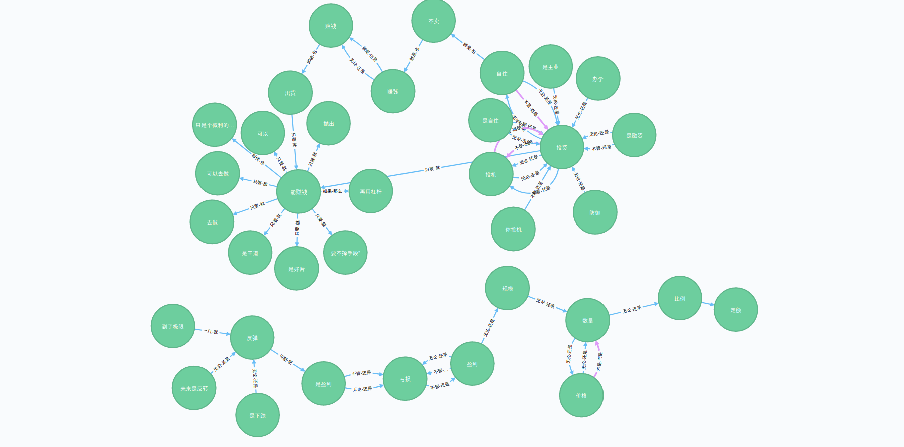

# 一、文本事理类型分析

中文复合事件抽取，可以用来识别文本的模式，包括条件事件、因果事件、顺承事件、反转事件。

我仅仅是对代码做了简单的修改，增加了函数说明注释和stats函数，可以用于统计文本中各种模式的分布(数量)情况。代码原作者为刘焕勇 https://github.com/liuhuanyong


### 事件图谱（事理图谱）的类型
项目地址https://github.com/liuhuanyong/ComplexEventExtraction 项目介绍很详细，感兴趣的一定要去原项目看一下。

| 事件     | 含义                     | 形式化     | 事件应用 | 图谱场景          | 举例                |
| -------- | ------------------------ | ---------- | -------- | ----------------- | ------------------- |
| 因果事件 | 某一事件导致某一事件发生 | A导致B     | 事件预警 | 因果溯源 由因求果 | <地震,房屋倒塌>     |
| 条件事件 | 某事件条件下另一事件发生 | 如果A那么B | 事件预警 | 时机判定          | <限制放宽,立即增产> |
| 反转事件 | 某事件与另一事件形成对立 | 虽然A但是B | 预防不测 | 反面教材          | <起步晚,发展快>     |
| 顺承事件 | 某事件紧接着另一事件发生 | A接着B     | 事件演化 | 未来意图识别      | <去旅游,买火车票>   |

分析出文本中的条件、因果、顺承、反转，理论上就可以构建知识网络(本库做不到这可视化)。
1、反转事件图谱

2、条件事件图谱



# 二、安装方法

### 2.1 方法一

最简单的安装,现在由于国内外网络不稳定，可能需要尝试几次

```
pip3 install eventextraction
```

### 2.2 加镜像站点

有的童鞋已经把pip默认安装镜像站点改为国内，如果国内镜像还未收录我的这个包，那么可能会安装失败。只能从国外

https://pypi.org/simple

站点搜索eventextraction资源并安装

```
pip3 install eventextraction -i https://pypi.org/simple
```

### 2.3 国内镜像安装

如果国内镜像站点已经收录，那么使用这个会更快

```
pip3 install eventextraction -i https://pypi.tuna.tsinghua.edu.cn/simple/
```


# 三、使用

### 3.1 主函数

```
from eventextraction import EventsExtraction

extractor = EventsExtraction()
content = '虽然你做了坏事，但我觉得你是好人。一旦时机成熟，就坚决推行'
datas = extractor.extract_main(content)
print(datas)

```

运行结果

```
[{'sent': '虽然你做了坏事，但我觉得你是好人', 'type': 'but', 'tuples': {'pre_wd': '虽然', 'pre_part': '你做了坏事，', 'post_wd': '但', 'post_part ': '我觉得你是好人'}},
{'sent': '一旦时机成熟，就坚决推行', 'type': 'condition', 'tuples': {'pre_wd': '一旦', 'pre_part': '时机成熟，', 'post_wd': '就', 'post_part ': '坚决推行'}}]

```


### 3.2 统计

```
from eventextraction import EventsExtraction

extractor = EventsExtraction()
content = '虽然你做了坏事，但我觉得你是好人。一旦时机成熟，就坚决推行'
datas = extractor.extract_main(content)
print(extractor.stats(datas))
```

运行结果

```
{'but': 1, 'condition': 1, 'seq': 0, 'more': 0, 'other': 0}
```


# 更多

- [B站:大邓和他的python](https://space.bilibili.com/122592901/channel/detail?cid=66008)
- 公众号：大邓和他的python
- [知乎专栏：数据科学家](https://zhuanlan.zhihu.com/dadeng)
- [《python网络爬虫与文本数据分析》](https://ke.qq.com/course/482241?tuin=163164df)视频课

